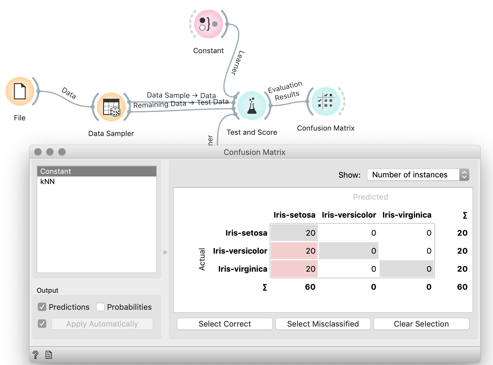

# Oefeningen KNN

## 1. Why do we use replicable sampling?

```
To take the same sample every time for fair comparison
```

## 2. Why do we use stratification?

```
To divide the data into equal sized subsets
```

## 3. How much is the average classification accuracy for the test data using Constant as the learner?

doe dit


Zorg dat je het juist verbindt


## 4. How much is the average classification accuracy for training set using KNN with k=1?

voeg KNN toe (met number of neighbors (n)  = 1)


klik nu op **Test en Score** en dan op het bolletje **Test on train data** en je zult het wel vinden

## 5. How much is the average classification accuracy for test set using KNN with k=1?

zelfde als de vorige, maar klik op **Test on test data**


## 6. Based on the confusion matrix, how many are misclassified for the Constant?

Voeg een confusion matrix toe.

Hint: rood :red_circle: betekent meestal fout.




## 7. Is the previous answer logical? Why or why not?

:warning: Don't quote me on this

Je gaat dingen klassificeren volgens een constante. Dus dan kan het bevoorbeeld dat we tegen alle bloemen zeggen dat ze Iris-setosa zijn. Ja, dan zijn er 20 juist en 40 fout.

## 8. How many are misclassified for KNN with k=2?

Zet het nummertje op 2 man